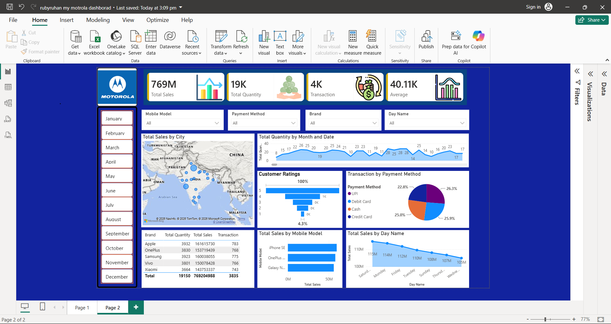

# 📊 Motorola Mobile Sales Dashboard - Power BI

## 📌 Project Overview

This project is an interactive Power BI dashboard built to analyze Motorola mobile sales data. It provides business insights using interactive visualizations, KPIs, filters, and charts.

---

## 🛠️ Tools & Technologies

- Microsoft Power BI
- Microsoft Excel
- Power Query
- DAX

---

## 📈 Dashboard Features

- 💰 Total Sales Analysis
- 📦 Total Quantity Sold
- 🛒 Total Transactions
- 📊 Average Sales
- 🏙️ City-wise Sales Analysis
- 📱 Mobile Model Performance
- ⭐ Customer Rating Analysis
- 💳 Payment Method Analysis
- 📅 Monthly Sales Trend
- 🎯 Interactive Filters and Slicers

---

## 📷 Dashboard Preview

> *(Upload your dashboard screenshot and make sure the filename matches below.)*

```markdown

```

---

## 📊 Key Insights

- Apple generated the highest sales.
- Card and UPI were the most preferred payment methods.
- Sales performance varied across different cities.
- Interactive filters allow dynamic analysis by month, brand, and payment method.

---

## 📂 Project Files

- MotorolaMobileSalesData.pbix
- Dashboard Screenshot

---

## 📌 Note

> The original dataset is not included in this repository as it was provided by the instructor for educational purposes.

---

## 👨‍💻 About Me

I am an aspiring Data Analyst passionate about building interactive dashboards and transforming raw data into meaningful business insights.

### Skills

- Power BI
- Excel
- SQL
- Python
- Power Query
- DAX
- Data Visualization

⭐ If you found this project helpful, don't forget to star this repository!
